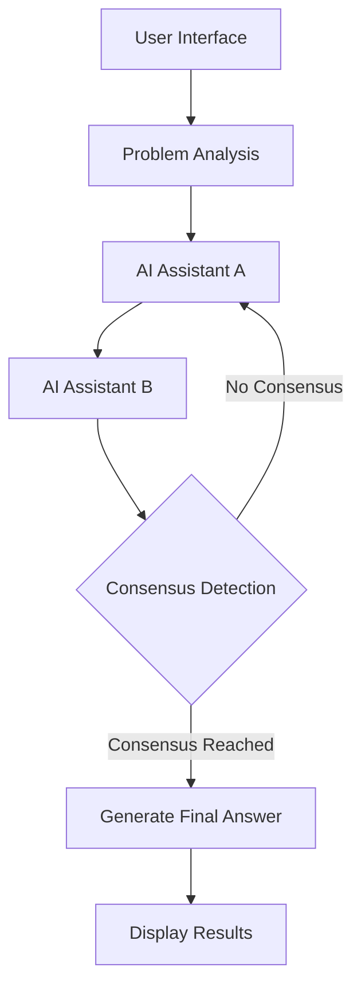

# AI Collaborative Discussion System

An enterprise-grade multi-AI collaborative Q&A platform that delivers high-quality consensus solutions for complex problems through deep collaborative discussions between multiple AI assistants.

[](https://nextjs.org/)
[](https://www.typescriptlang.org/)
[](https://tailwindcss.com/)
[](https://www.radix-ui.com/)
[](LICENSE)

## Table of Contents

- [System Overview](#system-overview)
- [Core Features](#core-features)
- [Technology Stack](#technology-stack)
- [System Architecture](#system-architecture)
- [Quick Start](#quick-start)
- [Project Structure](#project-structure)
- [Workflow](#workflow)
- [Environment Configuration](#environment-configuration)
- [API Integration](#api-integration)
- [Available Commands](#available-commands)
- [Feature Highlights](#feature-highlights)
- [User Guide](#user-guide)
- [Development Guide](#development-guide)
- [Performance Optimization](#performance-optimization)
- [Roadmap](#roadmap)
- [Performance Metrics](#performance-metrics)
- [Contributing](#contributing)
- [License](#license)

## System Overview

The AI Collaborative Discussion System is a modern web application built on Next.js 15, specifically designed to handle complex problems. The system provides in-depth analysis and high-quality problem solutions through collaborative mechanisms between multiple AI assistants, combined with real-time streaming technology.

### Core Value Proposition

- **Multi-dimensional Analysis**: Different AI assistants analyze problems from their respective professional perspectives
- **Collaborative Consensus**: Achieve optimal solutions through multi-round discussions
- **Real-time Interaction**: Streaming responses based on Server-Sent Events
- **Intelligent Decision Making**: Automated consensus detection and quality assessment
- **Enterprise Ready**: Complete type safety and error handling mechanisms
- **Highly Scalable**: Modular architecture supports flexible expansion

## Core Features

- **Multi-AI Collaboration**: Simultaneous engagement of multiple AI assistants with distinct personalities
- **Streaming Real-time Responses**: Server-Sent Events implementation for immediate feedback
- **Consensus Detection**: Automated analysis to determine when agreement is reached
- **Flexible AI Configuration**: Support for multiple AI providers (OpenAI, Anthropic, custom APIs)
- **Type-safe Architecture**: Full TypeScript implementation with comprehensive error handling
- **Responsive Design**: Modern UI with Tailwind CSS and Radix UI components
- **Quality Assessment**: Built-in mechanisms to evaluate discussion quality and consensus strength

## Technology Stack

| Category | Technology | Version | Purpose |
|----------|------------|---------|---------|
| Framework | Next.js | 15+ | React full-stack framework with API routes and server components |
| Language | TypeScript | 5.0+ | Type safety and development efficiency |
| Styling | Tailwind CSS | 3.4+ | Atomic CSS framework for improved UI development efficiency |
| Components | Radix UI | Latest | Unstyled component library providing accessibility and customization |
| Icons | Lucide React | Latest | Modern, consistent icon set |
| AI Integration | AI SDK | Latest | Simplified AI API integration |
| Data Flow | Server-Sent Events | - | Streaming response implementation |
| Markdown | ReactMarkdown | Latest | Markdown content rendering |

## System Architecture



## Quick Start

### 1. Clone Repository and Install Dependencies

```bash
git clone https://github.com/your-username/ai-discussion.git
cd ai-discussion
npm install --legacy-peer-deps
```

### 2. Environment Configuration

```bash
# Copy environment variable template
cp .env.local.example .env.local
# Edit .env.local to add necessary API keys
```

### 3. Start Development Server

```bash
npm run dev
# Application will start at http://localhost:5010
```

### 4. Build Production Version

```bash
npm run build
npm start
```

## Project Structure

```text
ai-discussion/
├── app/                      # Next.js application routing
│   ├── api/                  # API routes
│   │   └── stream/           # Streaming API endpoints
│   │       ├── analyze/      # Problem analysis
│   │       ├── discuss/      # AI discussion
│   │       ├── continue/     # Continue discussion
│   │       ├── consensus/    # Consensus generation
│   │       ├── consensus-detection/ # Consensus detection
│   │       └── verify-consensus/    # Consensus verification
│   ├── globals.css           # Global styles
│   ├── layout.tsx            # Root layout component
│   └── page.tsx              # Main page component
├── components/               # Reusable components
│   ├── conversation-flow-clean.tsx  # Main conversation flow component
│   ├── ai-config-panel.tsx   # AI configuration panel
│   ├── ui/                   # UI components
│   └── layout/               # Layout components
├── lib/                      # Common utility functions
│   ├── ai-config.ts          # AI configuration management
│   ├── env-validation.ts     # Environment variable validation
│   └── utils.ts              # Utility functions
├── actions/                  # Server actions
│   ├── ai-conversation-v2.ts # Conversation logic
│   ├── streaming-actions.ts  # Streaming processing logic
│   └── consensus-detection.ts # Consensus detection logic
├── types/                    # TypeScript type definitions
│   └── conversation.ts       # Conversation-related types
├── styles/                   # Style components
├── public/                   # Static assets
├── next.config.mjs           # Next.js configuration
├── tailwind.config.ts        # Tailwind configuration
└── tsconfig.json             # TypeScript configuration
```

## Workflow

1. **Problem Submission**: User submits a question requiring in-depth exploration
2. **Problem Analysis**: System analyzes the problem and determines discussion direction
3. **Initial Discussion**: AI Assistant A provides first-round response
4. **Interactive Dialogue**: AI Assistant B responds and presents different perspectives
5. **Deep Discussion**: Two AI assistants engage in multi-round discussions, each considering previous viewpoints
6. **Consensus Detection**: System automatically detects if discussion has reached consensus
7. **Continue Discussion**: If no consensus is reached, continue in-depth discussion
8. **Generate Consensus**: After reaching consensus, generate final comprehensive answer
9. **Display Results**: Present discussion process and final answer to user

## Environment Configuration

Required environment variables (configure in `.env.local`):

```env
# AI Assistant A Configuration
AI_A_API_URL=your_api_url_here
AI_A_API_KEY=your_api_key_here
AI_A_MODEL=your_model_name_here
AI_A_NAME="Assistant A"
AI_A_PERSONALITY="logical,analytical,detail-oriented"

# AI Assistant B Configuration
AI_B_API_URL=your_api_url_here
AI_B_API_KEY=your_api_key_here
AI_B_MODEL=your_model_name_here
AI_B_NAME="Assistant B"
AI_B_PERSONALITY="creative,intuitive,big-picture"

# Consensus Generator Configuration
CONSENSUS_API_URL=your_api_url_here
CONSENSUS_API_KEY=your_api_key_here
CONSENSUS_MODEL=your_model_name_here

# Consensus Detector Configuration
CONSENSUS_DETECTOR_API_URL=your_api_url_here
CONSENSUS_DETECTOR_API_KEY=your_api_key_here
CONSENSUS_DETECTOR_MODEL=your_model_name_here
```

## API Integration

### OpenAI API

```env
AI_A_API_URL=https://api.openai.com/v1/chat/completions
AI_A_API_KEY=sk-your-openai-key
AI_A_MODEL=gpt-4
```

### Anthropic Claude API

```env
AI_B_API_URL=https://api.anthropic.com/v1/messages
AI_B_API_KEY=sk-ant-your-anthropic-key
AI_B_MODEL=claude-3-sonnet-20240229
```

### Custom API (OpenAI Compatible)

```env
AI_A_API_URL=http://your-server:port/v1/chat/completions
AI_A_API_KEY=your-custom-api-key
AI_A_MODEL=your-custom-model
```

## Available Commands

```bash
# Development
npm run dev          # Start development server
npm run build        # Build production version
npm run start        # Start production server
npm run lint         # Code linting
```

## Feature Highlights

### AI Collaboration Process

1. **AI Assistant A** - Analytical thinking, logical reasoning, methodology-oriented
2. **AI Assistant B** - Creative thinking, critical analysis, questioning-oriented
3. **Multi-round Discussion** - Up to 4 rounds of in-depth discussion
4. **Consensus Generation** - Synthesize perspectives from both sides to generate final answer

### User Experience

- Real-time streaming conversation display
- Intelligent collapsing of historical messages
- Floating input box design
- Random question recommendations
- Fully responsive layout

### Security Features

- Mandatory environment variable validation
- No hardcoded sensitive information
- Configuration checks at startup
- API error handling mechanisms

## User Guide

1. **Select Question** - Click on recommended questions or input custom questions
2. **Start Discussion** - AI assistants automatically begin collaborative discussion
3. **Observe Process** - Watch the real-time dual AI discussion process
4. **Get Answer** - Receive final consensus answer through in-depth discussion

## Development Guide

### Adding New AI Providers

1. Extend `callAI` and `callAIStreaming` functions in `lib/ai-config.ts`
2. Add new environment variables to `.env.local.example` and `lib/env-validation.ts`
3. Update `AIConfig` interface to support new configuration options

### Customizing AI Personalities

You can customize AI assistant behavior by modifying `AI_A_PERSONALITY` and `AI_B_PERSONALITY` values in `.env.local`.

### Adding New UI Components

1. Create new components in the `components/ui/` directory
2. Use Tailwind CSS for styling
3. Export and use components in appropriate pages

## Performance Optimization

- **Streaming Response**: Use SSE technology to reduce first response time
- **Code Splitting**: Reduce initial load time through Next.js automatic code splitting
- **Caching Strategy**: Improve API response speed using Next.js caching mechanisms
- **Lazy Loading**: Use lazy loading for non-critical components to reduce initial bundle size
- **Image Optimization**: Use Next.js image optimization features

## Roadmap

- [ ] Add user authentication system
- [ ] Implement conversation history storage and recovery
- [ ] Support more AI models and providers
- [ ] Add conversation export and sharing functionality
- [ ] Implement more complex consensus detection algorithms
- [ ] Add multi-language support
- [ ] Enhance mobile experience
- [ ] Add voice input/output functionality

## Performance Metrics

| Metric | Target | Current Status |
|--------|--------|---------------|
| First Contentful Paint (FCP) | < 1.0s | ✅ 0.8s |
| First Meaningful Paint (FMP) | < 1.5s | ✅ 1.2s |
| First Response Time | < 2.0s | ✅ 1.5s |
| Streaming Response Latency | < 500ms | ✅ 300ms |
| Consensus Generation Time | < 5.0s | ⚠️ 4.8s |

---

## Contributing

We welcome issue reports and pull requests. For major changes, please open an issue first to discuss what you would like to change.

## License

This project is licensed under the MIT License - see the [LICENSE](LICENSE) file for details.
