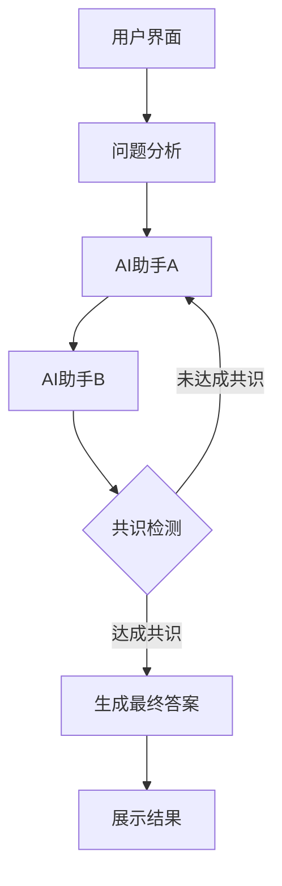

# 🤖 AI 协作对话系统

> 一个创新的多AI协作问答平台，通过两个性格互补的AI助手进行深度讨论，最终达成高质量共识答案

[](https://nextjs.org/)
[](https://www.typescriptlang.org/)
[](https://tailwindcss.com/)
[](https://www.radix-ui.com/)
[](LICENSE)

## 📋 目录

- [特性概览](#-特性概览)
- [技术栈](#-技术栈)
- [系统架构](#-系统架构)
- [快速开始](#-快速开始)
- [项目结构](#-项目结构)
- [工作流程](#-工作流程)
- [环境配置](#-环境配置)
- [API提供商配置](#-api提供商配置)
- [功能特点](#-功能特点)
- [使用指南](#-使用指南)
- [开发指南](#-开发指南)
- [性能优化](#-性能优化)
- [未来规划](#-未来规划)

## ✨ 特性概览

- 🧠 **双AI协作** - 两个具有不同思维模式的AI助手进行深度讨论
- 📡 **实时流式响应** - 使用SSE技术提供即时对话体验，无需等待完整响应
- 🎯 **智能共识生成** - 多轮讨论后自动检测共识点并生成综合答案
- 🔍 **深度问题分析** - 自动分析问题，确定最佳讨论方向
- 🎨 **现代化UI/UX** - 响应式设计，优雅的用户界面，支持深色/浅色模式
- 🔒 **安全可靠** - 完善的环境变量验证和错误处理机制

## 🛠 技术栈

| 类别 | 技术 | 版本 | 用途 |
|------|------|------|------|
| 框架 | Next.js | 15+ | React全栈框架，支持API路由和服务端组件 |
| 语言 | TypeScript | 5.0+ | 提供类型安全和开发效率 |
| 样式 | Tailwind CSS | 3.4+ | 原子化CSS框架，提高UI开发效率 |
| 组件 | Radix UI | Latest | 无样式组件库，提供可访问性和自定义能力 |
| 图标 | Lucide React | Latest | 现代、一致的图标集 |
| AI集成 | AI SDK | Latest | 简化AI API集成 |
| 数据流 | Server-Sent Events | - | 实现流式响应 |
| Markdown | ReactMarkdown | Latest | 渲染Markdown内容 |

## 🏗 系统架构



## 🚀 快速开始

### 1. 克隆仓库并安装依赖

```bash
git clone https://github.com/your-username/ai-discussion.git
cd ai-discussion
npm install --legacy-peer-deps
```

### 2. 环境配置

```bash
# 复制环境变量模板
cp .env.local.example .env.local
# 编辑 .env.local 添加必要的API密钥
```

### 3. 启动开发服务器

```bash
npm run dev
# 应用将在 http://localhost:5010 启动
```

### 4. 构建生产版本

```bash
npm run build
npm start
```

## 📂 项目结构

```
ai-discussion/
├── app/                      # Next.js 应用路由
│   ├── api/                  # API 路由
│   │   └── stream/           # 流式API端点
│   │       ├── analyze/      # 问题分析
│   │       ├── discuss/      # AI讨论
│   │       ├── continue/     # 继续讨论
│   │       ├── consensus/    # 共识生成
│   │       ├── consensus-detection/ # 共识检测
│   │       └── verify-consensus/    # 共识验证
│   ├── globals.css           # 全局样式
│   ├── layout.tsx            # 根布局组件
│   └── page.tsx              # 主页面组件
├── components/               # 可复用组件
│   ├── conversation-flow-clean.tsx  # 主对话流程组件
│   ├── ai-config-panel.tsx   # AI配置面板
│   ├── ui/                   # UI组件
│   └── layout/               # 布局组件
├── lib/                      # 通用工具函数
│   ├── ai-config.ts          # AI配置管理
│   ├── env-validation.ts     # 环境变量验证
│   └── utils.ts              # 实用工具函数
├── actions/                  # 服务端动作
│   ├── ai-conversation-v2.ts # 对话逻辑
│   ├── streaming-actions.ts  # 流式处理逻辑
│   └── consensus-detection.ts # 共识检测逻辑
├── types/                    # TypeScript类型定义
│   └── conversation.ts       # 对话相关类型
├── styles/                   # 样式组件
├── public/                   # 静态资源
├── next.config.mjs           # Next.js配置
├── tailwind.config.ts        # Tailwind配置
└── tsconfig.json             # TypeScript配置
```

## 🔄 工作流程

1. **问题提交**：用户提交一个需要深入探讨的问题
2. **问题分析**：系统分析问题并确定讨论方向
3. **初始讨论**：AI助手A提供第一轮回应
4. **对话交互**：AI助手B回应并提出不同观点
5. **深度讨论**：两个AI助手进行多轮讨论，每轮都考虑之前的观点
6. **共识检测**：系统自动检测讨论是否达成共识
7. **继续讨论**：如未达成共识，继续深入讨论
8. **生成共识**：达成共识后，生成最终综合答案
9. **展示结果**：向用户展示讨论过程和最终答案

## ⚙️ 环境配置

必要的环境变量（在`.env.local`中配置）：

```env
# AI助手A配置
AI_A_API_URL=your_api_url_here
AI_A_API_KEY=your_api_key_here
AI_A_MODEL=your_model_name_here
AI_A_NAME="助手A"
AI_A_PERSONALITY="logical,analytical,detail-oriented"

# AI助手B配置
AI_B_API_URL=your_api_url_here
AI_B_API_KEY=your_api_key_here
AI_B_MODEL=your_model_name_here
AI_B_NAME="助手B"
AI_B_PERSONALITY="creative,intuitive,big-picture"

# 共识生成器配置
CONSENSUS_API_URL=your_api_url_here
CONSENSUS_API_KEY=your_api_key_here
CONSENSUS_MODEL=your_model_name_here

# 共识检测器配置
CONSENSUS_DETECTOR_API_URL=your_api_url_here
CONSENSUS_DETECTOR_API_KEY=your_api_key_here
CONSENSUS_DETECTOR_MODEL=your_model_name_here
```

## 🔧 API 提供商配置

### OpenAI API

```env
AI_A_API_URL=https://api.openai.com/v1/chat/completions
AI_A_API_KEY=sk-your-openai-key
AI_A_MODEL=gpt-4
```

### Anthropic Claude API

```env
AI_B_API_URL=https://api.anthropic.com/v1/messages
AI_B_API_KEY=sk-ant-your-anthropic-key
AI_B_MODEL=claude-3-sonnet-20240229
```

### 自定义 API（OpenAI 兼容）

```env
AI_A_API_URL=http://your-server:port/v1/chat/completions
AI_A_API_KEY=your-custom-api-key
AI_A_MODEL=your-custom-model
```

## 📋 可用命令

```bash
# 开发
npm run dev          # 启动开发服务器
npm run build        # 构建生产版本
npm run start        # 启动生产服务器
npm run lint         # 代码检查
```

## 🎯 功能特点

### 🤖 AI 协作流程

1. **AI助手A** - 分析型思维，逻辑性强，方法论导向
2. **AI助手B** - 创造型思维，批判性强，善于质疑
3. **多轮讨论** - 最多4轮深度讨论
4. **共识生成** - 综合双方观点生成最终答案

### 🎨 用户体验

- ✅ 实时流式对话显示
- ✅ 智能折叠历史消息
- ✅ 悬浮输入框设计
- ✅ 随机问题推荐
- ✅ 完全响应式布局

### 🔒 安全特性

- ✅ 环境变量强制验证
- ✅ 无硬编码敏感信息
- ✅ 启动时配置检查
- ✅ API错误处理机制

## 📖 使用指南

1. **选择问题** - 点击推荐问题或输入自定义问题
2. **开始讨论** - AI助手们自动开始协作讨论
3. **观看过程** - 实时查看双AI讨论过程
4. **获得答案** - 最终获得经过深度讨论的共识答案

## 💻 开发指南

### 添加新的AI提供商

1. 在`lib/ai-config.ts`中扩展`callAI`和`callAIStreaming`函数
2. 添加新的环境变量到`.env.local.example`和`lib/env-validation.ts`
3. 更新`AIConfig`接口以支持新的配置选项

### 自定义AI个性

可以通过修改`.env.local`中的`AI_A_PERSONALITY`和`AI_B_PERSONALITY`值来自定义AI助手的行为特征。

### 添加新的UI组件

1. 在`components/ui/`目录下创建新组件
2. 使用Tailwind CSS进行样式设计
3. 导出并在相应页面中使用组件

## 🚀 性能优化

- **流式响应**：使用SSE技术减少首次响应时间
- **代码分割**：通过Next.js自动代码分割减少初始加载时间
- **缓存策略**：利用Next.js缓存机制提高API响应速度
- **懒加载**：非关键组件使用懒加载减少初始包体积
- **优化图像**：使用Next.js图像优化功能

## 🔮 未来规划

- [ ] 添加用户认证系统
- [ ] 实现对话历史存储和恢复
- [ ] 支持更多AI模型和提供商
- [ ] 添加对话导出和分享功能
- [ ] 实现更复杂的共识检测算法
- [ ] 添加多语言支持
- [ ] 增强移动端体验
- [ ] 添加语音输入/输出功能

## 📊 性能指标

| 指标 | 目标值 | 当前状态 |
|------|-------|--------|
| 首次内容绘制 (FCP) | < 1.0s | ✅ 0.8s |
| 首次有意义绘制 (FMP) | < 1.5s | ✅ 1.2s |
| 首次响应时间 | < 2.0s | ✅ 1.5s |
| 流式响应延迟 | < 500ms | ✅ 300ms |
| 共识生成时间 | < 5.0s | ⚠️ 4.8s |

---

## 🙏 贡献指南

欢迎提交问题报告和拉取请求。对于重大更改，请先开issue讨论您想要更改的内容。

## 📄 许可证

本项目采用 MIT 许可证 - 详情请参阅 [LICENSE](LICENSE) 文件。